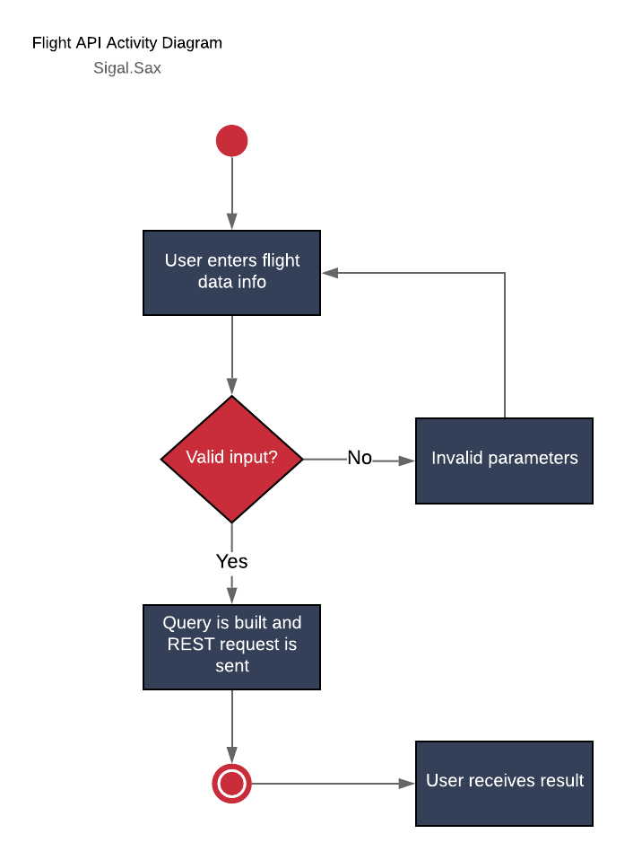

# FlightAPI

This project evokes the SkyScanner Flight API (with the help of RapidAPI wrapper to check the lowest price available for travel between two locations for a specific date.

## Design

The following defines the sequence diagram for this project.   

## Milestones

- [x] Use LucidChart to create a Activity Diagram

- [x] Create basic backend that has initial hardcoded values, but receives correct data using the [Skyscanner API](https://rapidapi.com/skyscanner/api/skyscanner-flight-search)

  - [x] Add capability to receive, consolidate, format, and package data before sending response

- [x] Add a front end and add functionality to accept user input to build the Flight query

- [x] Add Reactive Forms for data validation

- [ ] Front-end design created in Adobe Photoshop of SOAP layout

  - [ ] Design should include a table of required input format (chart for airport acronyms and airport names). Ex: MIA -> Miami

- [ ] Improve UX by adding CSS to Flight component

- [ ] Add layer b/w presentation layer and BL to convert input to expected format. Example: Miami -> MIA or Tel Aviv -> TLV

- [ ] Expand functionality support round-trip

## Security Milestones

- [x] Add validation on form fields to ensure nothing is left blank

- [ ] Add validation to ensure there are no unwanted special characters (`<, >, &, @, ', ", ;`) in Origin and Destination.

- [ ] Clean input from View on Date to prevent against malicious code execution on special characters

  -  Add extra layer b/w presentation layer and BL to do this encode/filter before data manipulation

## Open bugs to fix:

- [x] Multiple query data should be returned, not just last

- [x] Check if Quotes array is empty and if so, render message to View

- [ ] Fix toggling bug when empty query/query with results, the messages disappear accordingly

- [ ] Unsubscribe from Observable/s

## Areas to explore

- [x] Reactive forms for data validation

- [ ] Look into Angular Elements for Date Picker

- [ ] Angular Material for styling
