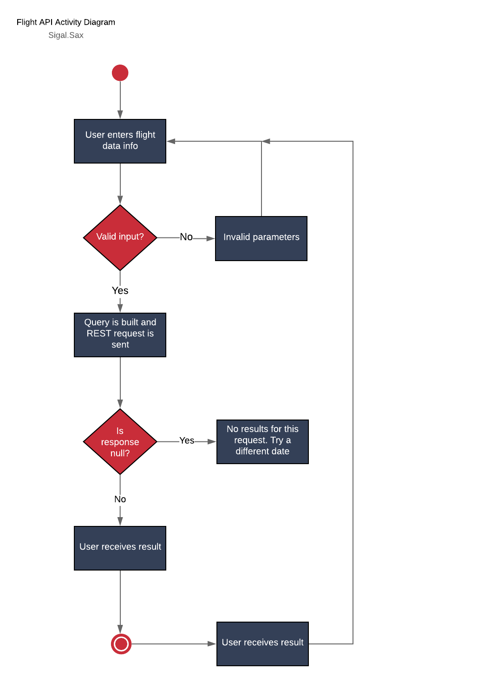

# FlightAPI

This project evokes the SkyScanner Flight API (with the help of RapidAPI wrapper to check the lowest price available for travel between two locations for a specific date.

## Design

The following defines the sequence diagram for this project.   



UI Mock: https://www.figma.com/file/4fZOxVvGOWUz4bSCtY8YAX/FlightMock?node-id=0%3A1
 
## Milestones

- [x] Use LucidChart to create a Activity Diagram

- [x] Create basic backend that has initial hardcoded values, but receives correct data using the [Skyscanner API](https://rapidapi.com/skyscanner/api/skyscanner-flight-search)

  - [x] Add capability to receive, consolidate, format, and package data before sending response

- [x] Add a front end and add functionality to accept user input to build the Flight query

- [x] Add Reactive Forms for data validation

- [x] Front-end design created in Figma for SPA layout

- [x] Improve UX by adding CSS to Flight component

- [x] Configure app to display results

- [ ] Add ability to convert input to expected format. Example: MIA -> Miami or TLV -> Tel Aviv

- [ ] Expand functionality support round-trip

- [ ] Skyscanner client does not support links back to site for customer purchasing so I will need to manually add this link to improve UX. Bare URL resembles the following: 

  ```
  https://www.skyscanner.co.il/transport/flights/mia/tlv/200508/200528/?adults=1&children=0&adultsv2=1&childrenv2=&infants=0&cabinclass=economy&rtn=1&preferdirects=false&outboundaltsenabled=false&inboundaltsenabled=false&ref=home
  ```

## Security Milestones

- [x] Add validation on form fields to ensure nothing is left blank

- [ ] Add validation to ensure there are no unwanted special characters (`<, >, &, @, ', ", ;`) in Origin and Destination.
  
  *NOTE:* tested. API client URL encodes query but should clean this input on submit

- [x] Clean input from View on Date to prevent against malicious code execution on special characters.
 
  *NOTE:* protected by Angular Material DatePicker. The DatePicker requires input in a specific date format.

  -  Add extra layer b/w presentation layer and BL to do this encode/filter before data manipulation

## Open bugs to fix:

- [x] Multiple query data should be returned, not just last

- [x] Check if Quotes array is empty and if so, render message to View

- [x] Fix toggling bug when empty query/query with results, the messages disappear accordingly

- [x] Unsubscribe from Observable/s

## Areas to explore

- [x] Reactive forms for data validation

- [x] Look into Angular Elements for Date Picker

- [x] Angular Material for styling
